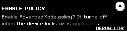

# Gate 3 — AdvancedMode confirm screen

On-device proof for the session-scoped AdvancedMode change (PR #373).



```
ENABLE POLICY
Enable AdvancedMode policy? It turns off
when the device locks or is unplugged.
```

## Why this screen needed proof

`fsm_msgApplyPolicies` shows one confirm per policy, and it is the **only** place
the device states what enabling costs. The generic wording ("Do you want to
enable AdvancedMode policy?") reads as permanent, which is what the policy used
to be. Once it became session state, that screen was actively misleading.

Two properties had to be seen rather than calculated:

1. **It fits.** `confirm_helper` paginates now, but overflow is value-dependent —
   a longer body silently becomes two pages and a second `ButtonAck`, changing
   the host protocol. The first wording measured at exactly 3 lines against
   `BODY_ROWS` 3: correct, but with zero headroom. The shipped wording is 79
   characters and renders in **2 lines**, so there is room for a future edit.

2. **It says both.** The policy disarms on unplug *and* on lock
   (`session_clear_impl`, gated on `clear_pin`). An earlier draft said only
   "when you unplug the device" — accurate but incomplete, and the omission is
   the surprising direction: lock the device, come back, blind signing is off
   and nothing had said it would be.

## Reproducing

`capture.py` is the pytest case that produced this, run against the emulator
built from the branch:

    docker compose build kkemu && docker compose up -d kkemu
    docker compose run --rm --entrypoint sh \
      -v capture.py:/kkemu/deps/python-keepkey/tests/test_gate3_advancedmode.py \
      python-keepkey -c "cd /kkemu/deps/python-keepkey/tests && \
        KEEPKEY_SCREENSHOT=1 SCREENSHOT_DIR=/kkemu/gate3 \
        KK_TRANSPORT_MAIN=kkemu:11044 KK_TRANSPORT_DEBUG=kkemu:11045 \
        PYTHONPATH=.. python3 -m pytest test_gate3_advancedmode.py -q"

The emulator runs the same layout and font code as the device, so the wrap is
faithful. The `DEBUG_LINK` watermark is the emulator's own overlay.
